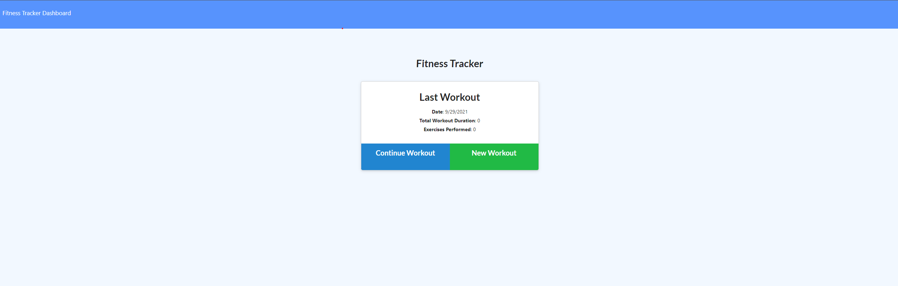
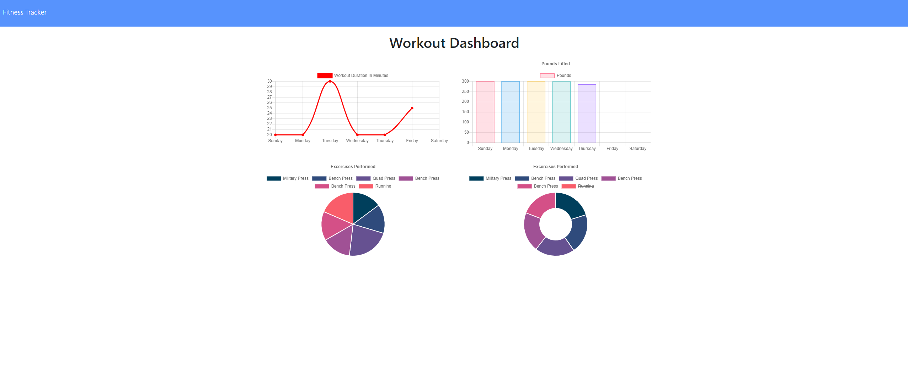

# Fitness Tracker
  
  ## Description
  This application is meant to record workouts by entering in different excercises. It also gives you charts to display your workouts data.

  ## Table of Contents
  - [Usage](#usage)
  - [License](#license)
  - [Questions](#questions)

  ## Usage
  Click on New Workout. Then enter each excercise individually. After entering in each excerices data, press the "Add Exercise" to save it to your workout. Once you have entered every excercise, press "Complete" and your workout will be saved. Click the link in the top left corner to see charts based on your workout data.   
  
  ## Questions
  Want to reach me or see more of my work and projects? My Github is linked below and my Email is listed as well.
  * [Github](https://github.com/Colon182)
  * christian.colon27@gmail.com

  # License
    Licensed under MIT license.
